# bmstu-web-7th-sem

## Цель работы

BOB – это распределённая система хранения данных типа ключ-значение с поддержкой шардирования и реплицирования.
BOB проектировался для быстрой и надёжной работы с бинарными данными средних размеров (например, изображения).
Благодаря одноранговой архитектуре, каждая нода кластера может обрабатывать входящие запросы на равных с остальными.

На продакшене размер кластера BOB'а запросто может перевалить за 100 серверов и на таких размерах возникает проблема с его мониторингом.
На текущий момент эта проблема решается сторонними средствами, в частности набором утилит ELK, Graphite и Zabbix.

В ходе своей работы, BOB отслеживает ряд метрик, которые он способен передавать по REST API вместе с информацией о всем кластере.

Цель данного проекта - разработать единую систему мониторинга этих данных.
Среди этих данных можно выделить такие, как доступность нод, RPS всего кластера и отдельных нод, работоспособность отдельных дисков на нодах, но ни в коей мере ими не ограничивается.

## Перечень функциональных требований

1. Страница авторизации. Задаём адрес входной ноды и опционально логин и пароль.
2. Домашняя страница с основными параметрами кластера: число нод в кластере, число рабочих нод, число нод с проблемами, число не рабочих нод, тоже самое по физическим дискам, общее число обрабатываемых запросов на кластере в секунду с разбивкой далее по put, get, exist, delete, общее место на дисках кластера, занятое данными место на дисках всего кластера.
   Также тут должна быть возможность перейти и посмотреть cluster.yaml.
3. Страница с нодами.
   На этой странице должна быть карта кластера: отображаться все ноды с именем и адресом, по каждой ноде её состояние (работает, есть проблемы, не работает), операции в секунду на ноде, занятое дисковое пространство. Перечень проблем на ноде: не доступен один из дисков, есть alien’ы, есть corrupted БЛОБы, осталось свободного места менее 10%, виртуальная память, выделенная ноде, превышает доступную физическую память, нагрузка на CPU выше 90%. При клике на ноду переход на подробную информацию о ноде.
4. Страница с подробной информацией о ноде.
   Тут нужно показывать основные метрики ноды, параметры железа (загрузка CPU, RAM, дескрипторы), список дисков на ноде с их состоянием, список виртуальных дисков внутри каждого диска. Тут можно добавить возможность просмотра конфигурации ноды (файл node.yaml). Также заложить возможность просмотра последних логов ноды. Также дать возможность просмотра целиком метрик ноды в виде таблицы.
5. Страница с раскладкой виртуальных дисков.
   Нужно вывести список vdisk’ов с их доступностью в кластере. Например, если в кластере 3 копии vdisk 1, но нода с одной из копий не доступна, то показывать «2/3»

## BPMN

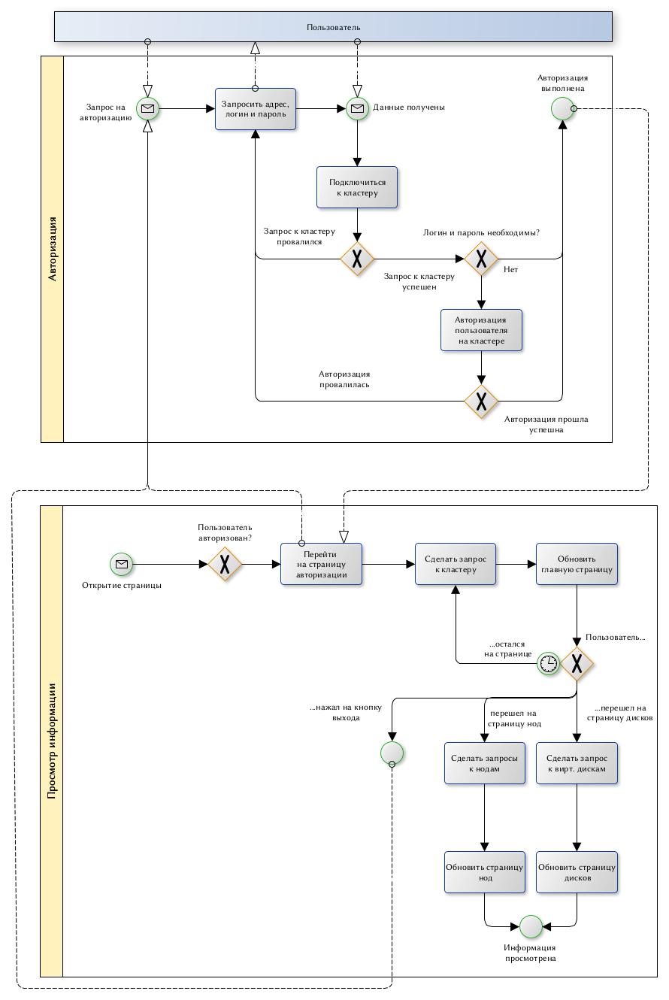

## Пользовательские сценарии

### Прсмотр общей информации

_Агент_: Пользователь\Сис.Админ

_Цель_: Просмотр общей информации по всему кластеру.

Шаги:

1. Зайти на сайт
2. Ввести данные для авторизации на кластере - адрес входной ноды + Пароль и Логин
3. Перейти на главную страницу
4. Просмотреть общие данные по кластеру

### Прсмотр информации о конкретной ноде

_Агент_: Пользователь\Сис.Админ

_Цель_: Просмотр информации по конкретной ноде из кластера.

Шаги:

1. Зайти на сайт
2. Ввести данные для авторизации на кластере - адрес входной ноды + Пароль и Логин
3. Перейти на страницу выбора ноды
4. Выбрать необходимую ноду из общего списка
5. Просмотреть данные по ноде

### Добавление новой информации в кластер

_Агент_: Сис.Админ

_Цель_: Добавление информации в базу даннных из локального хранилища.

Шаги:

1. Зайти на сайт
2. Ввести данные для авторизации на кластере - адрес входной ноды + Пароль и Логин
3. Перейти на страницу выбора ноды
4. Выбрать необходимую ноду из общего списка
5. Выбрать опцию доступа к данным кластера
6. Ввести или сгенерировать id для новой записи, а также загрузить сами данные

### Запуск утилиты на ноде

_Агент_: Сис.Админ

_Цель_: Запуск утилиты для восстановления данных после сбоя или для удаления устаревших данных.

Шаги:

1. Зайти на сайт
2. Ввести данные для авторизации на кластере - адрес входной ноды + Пароль и Логин
3. Перейти на страницу выбора ноды
4. Выбрать необходимую ноду из общего списка
5. Выбрать опцию запуска утилиты
6. Ввести параметры для утилиты и запустить её

## ER

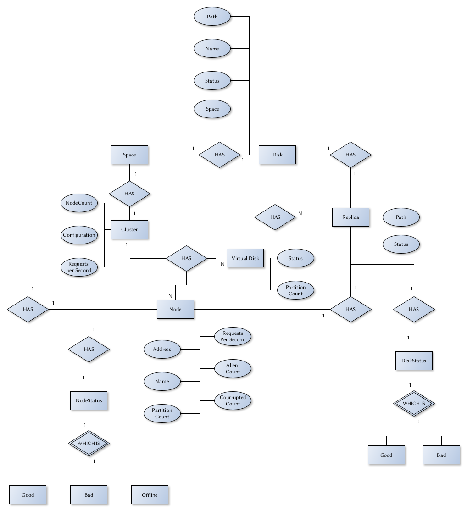

## Компоненты системы

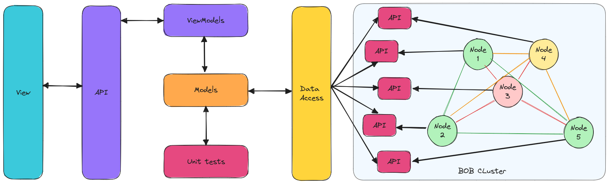

## Интерфейс (Эскизы)

### Login Page

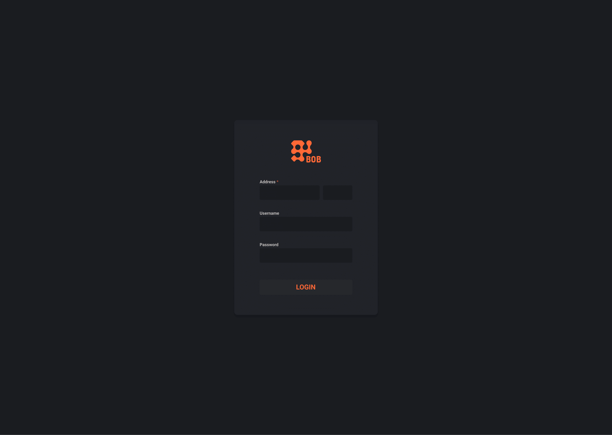

### Monitoring Screen

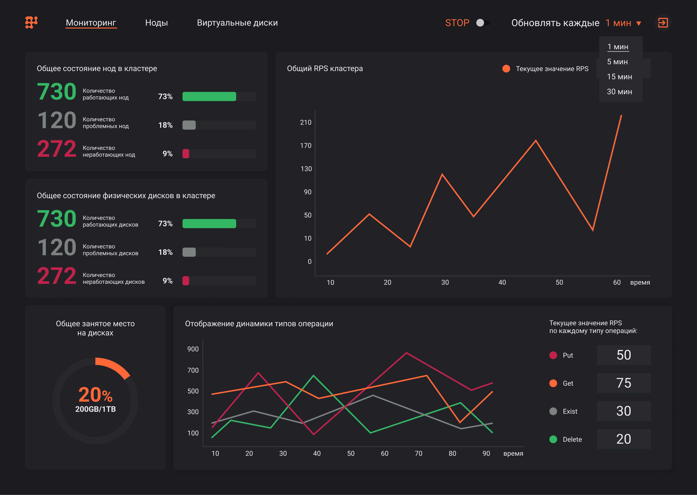

### Nodes Page

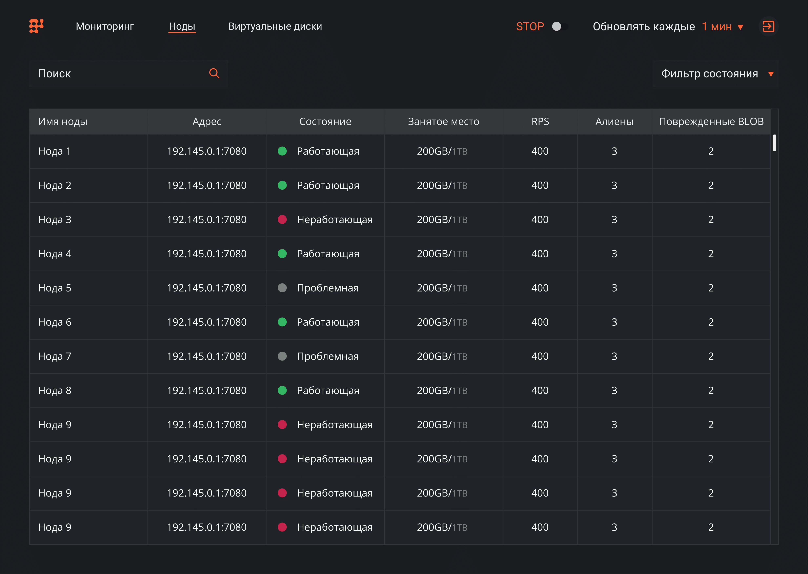

### Node Page

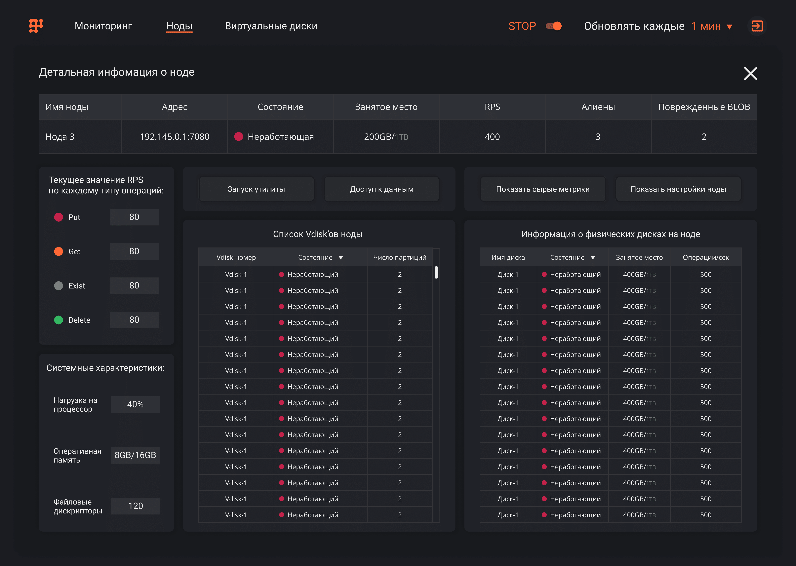
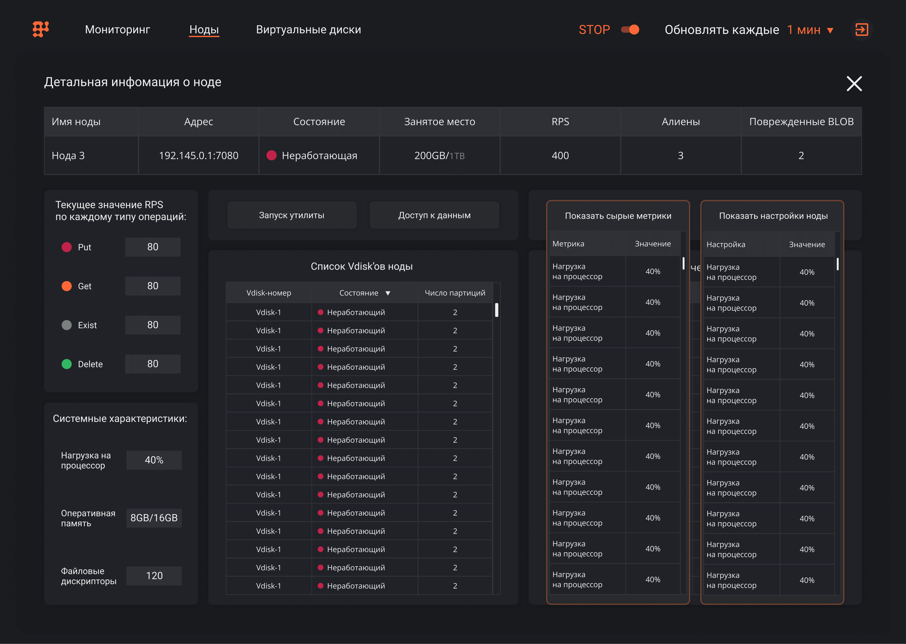
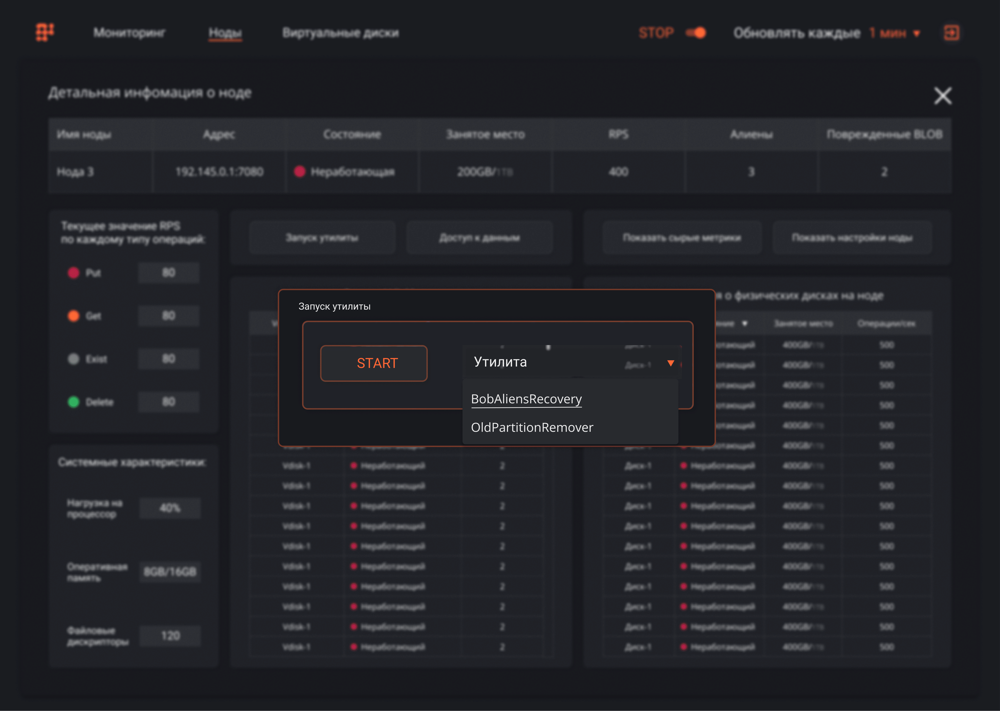
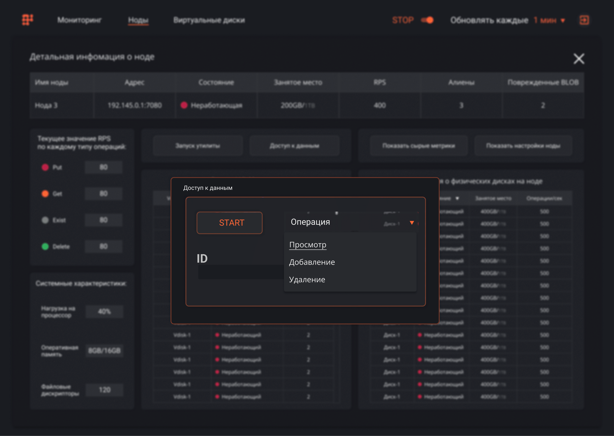

### Virtual Disks Page

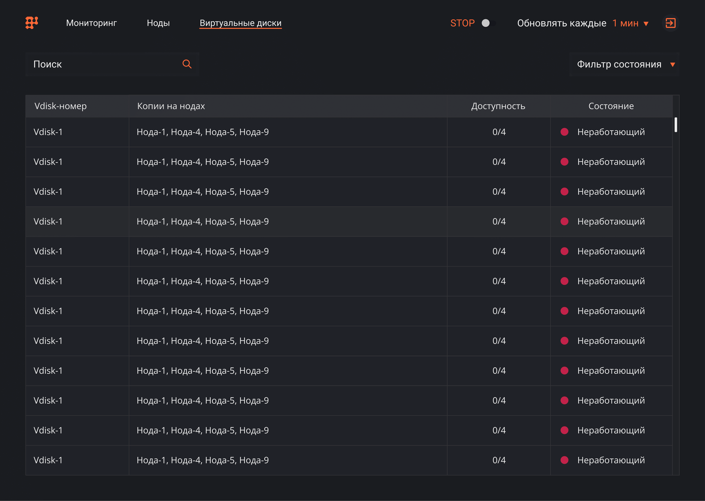
